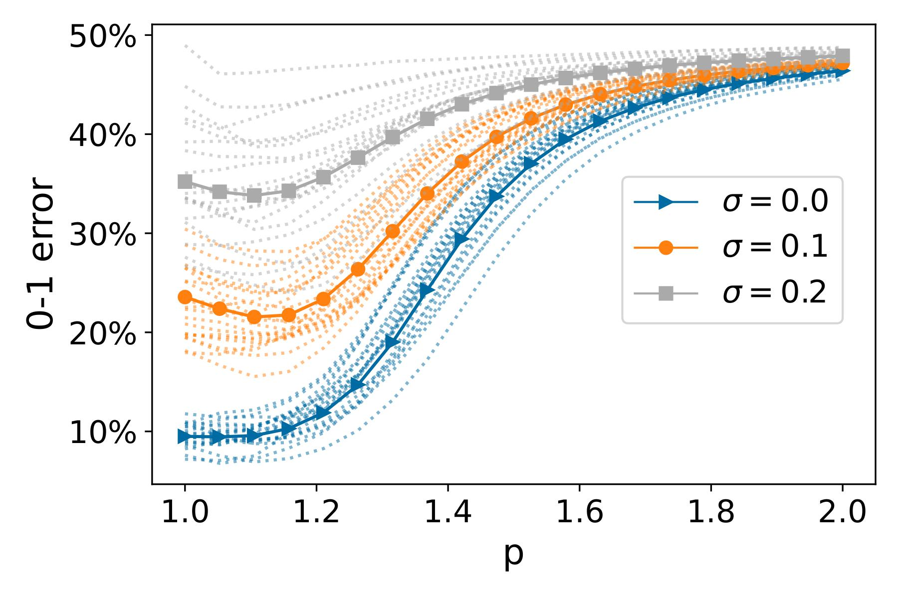

# Fast rates for noisy interpolation require rethinking the effects of inductive bias
Experimental evaluation of the results presented in 

_"Fast rates for noisy interpolation require rethinking the effects of inductive bias"_\
Donhauser K., Ruggeri N., Stojanovic S., Yang F.

<p align="center">

</p>

## Requirements 
In all the experiments we utilize Python `3.8.3`. \
Any additional package requirements are listed in `requirements.txt`, and can be installed via command line \
```pip install requirements.txt```

### Convex solvers
For convex optimization problems, we rely on the [CVXPY](https://www.cvxpy.org/) package. A variety of 
open-source solvers are available 
[here](https://www.cvxpy.org/tutorial/advanced/index.html#choosing-a-solver). \
Any solver can be specified via the `--solver` command line argument in `main_lp_svc.py` and `main_lp_svr.py`.

In our experiments we rely on [Mosek](https://www.mosek.com/), which we observed to be faster and more accurate than 
other convex programming solvers.
While Mosek is a commercial product, they provide free academic licenses for research or educational purposes at 
degree-granting academic institutions to faculty, students, and staff. To obtain a license, visit 
[https://www.mosek.com/products/academic-licenses/](https://www.mosek.com/products/academic-licenses/) and register 
using your email address from your academic institution.

The solver will by default assume the license file to be in `$HOME/mosek/mosek.lic`. The path can be changed by setting 
the `MOSEKLM_LICENSE_FILE` environment variable. Refer to the 
[Mosek website](https://docs.mosek.com/latest/install/installation.html)
for further installation instructions.

## Experiments
### Classification: synthetic and Leukemia datasets
For replicating the classification experiments in the paper, run 

```python main_lp_svr.py --dataset X --p X --label_noise X```

where the parameters `p` and `label_noise` can be specified. \
The dataset can be chosen between `leukemia` and `synthetic_n=100_d=5000`. \
For synthetic data, the values of `n` anfd `d` can be customized.

### Regression: synthetic data
Similarly, the regression experiments can be replicated by specifying `p` and `noise` in

```python main_lp_svr.py --dataset synthetic_n=100_d=5000 --p X --noise X```

### Convolutional Neural Tangent Kernel on Binarized MNIST
To replicate the CNTK experiments, specify the parameters in 

```python main_cntk.py --kernel_size X --depth X --label_noise X```

